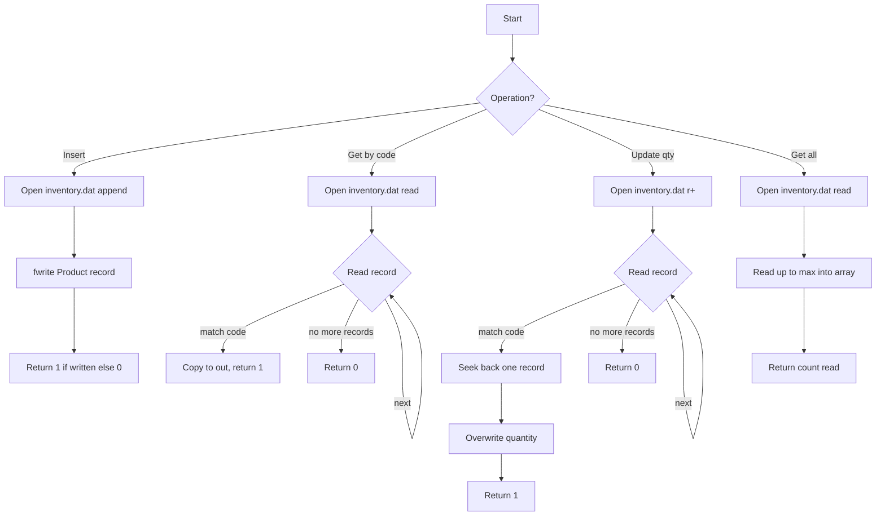
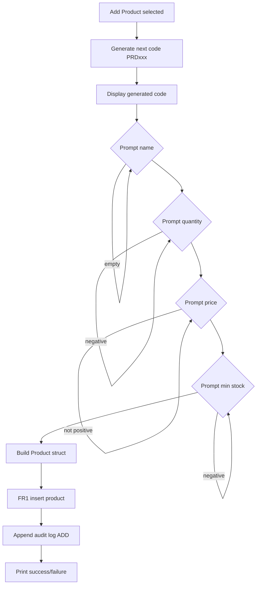
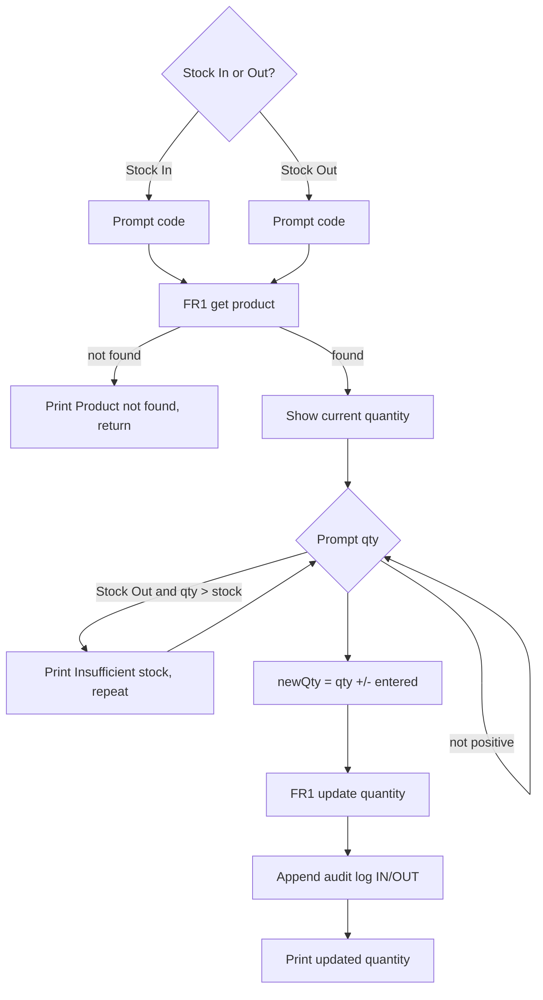
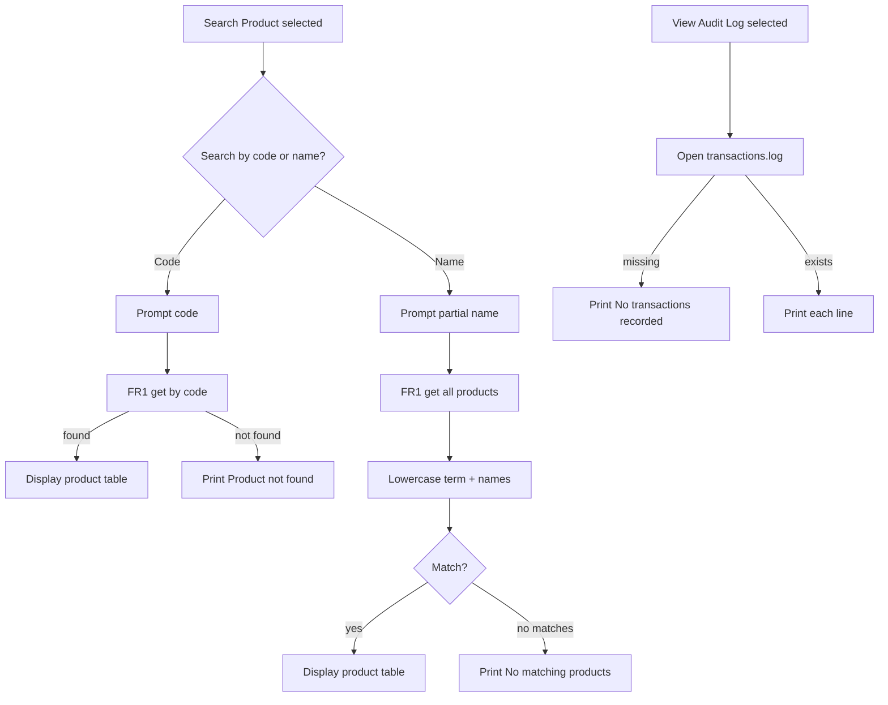
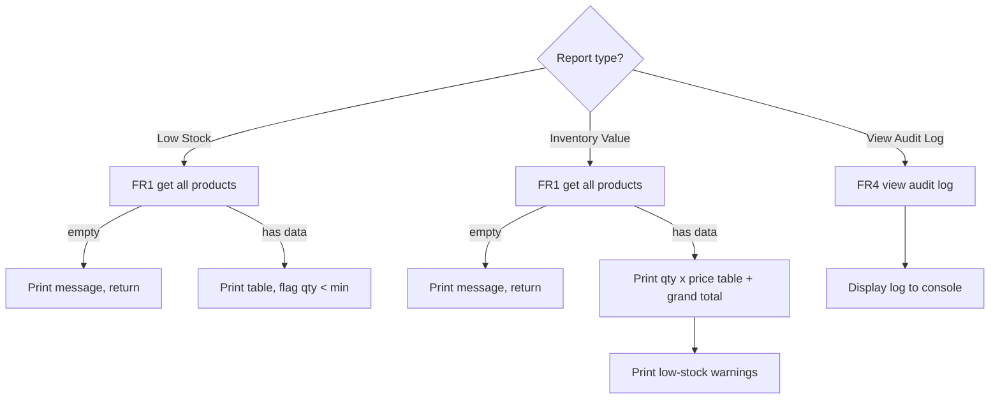
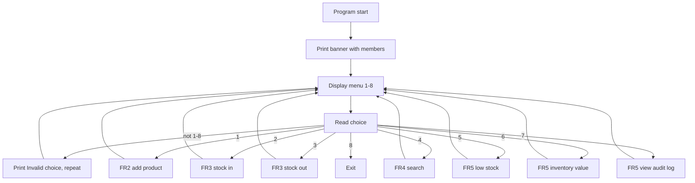

# User Flowcharts

Flowcharts for each team member's feature area. Each diagram shows the
control flow of the primary menu-driven tasks owned by that user.

---

## Thina — FR1: Database SDK (file_db)

Owns all binary I/O on `inventory.dat`.

---

## Lida — FR2: Add Product

Owns product creation, code generation, and audit append.

---

## Samrith — FR3: Stock In / Stock Out

Owns stock movement and product counting.

---

## Kelly — FR4: Search & Audit Log

Owns search by code/name and audit log viewing.

---

## Lado — FR5: Reports & Build

Owns low-stock report, inventory value, audit viewer UI, and build system.

---

## Rith — FR6: Main Menu & Integration

Owns program entry point, menu loop, and shared headers.

