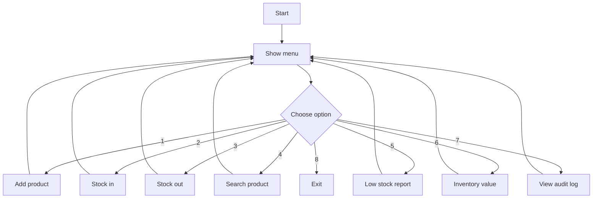
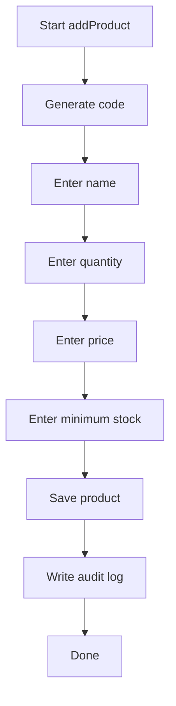
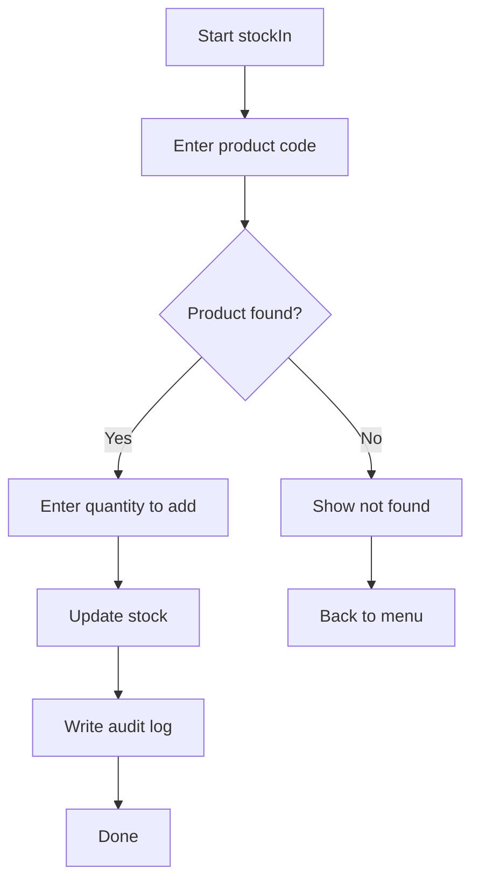
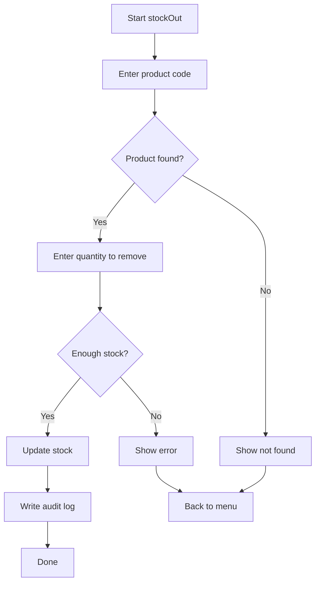
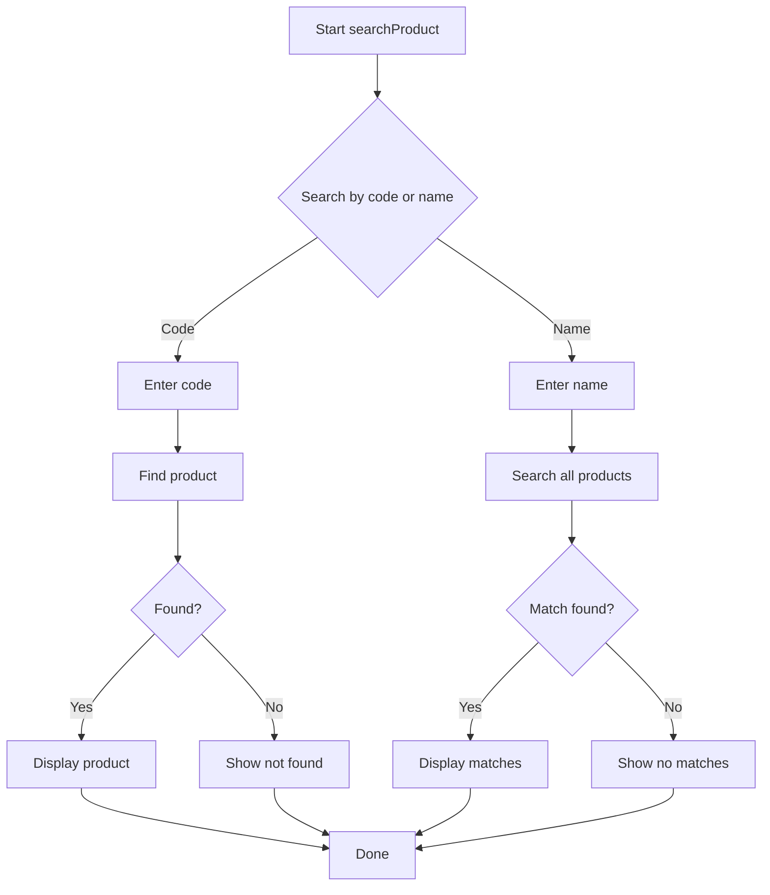
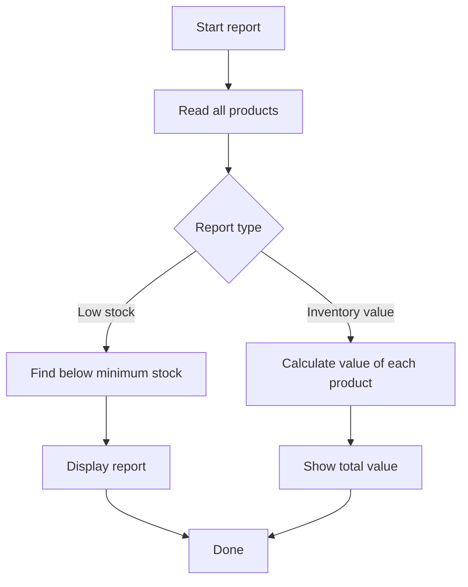
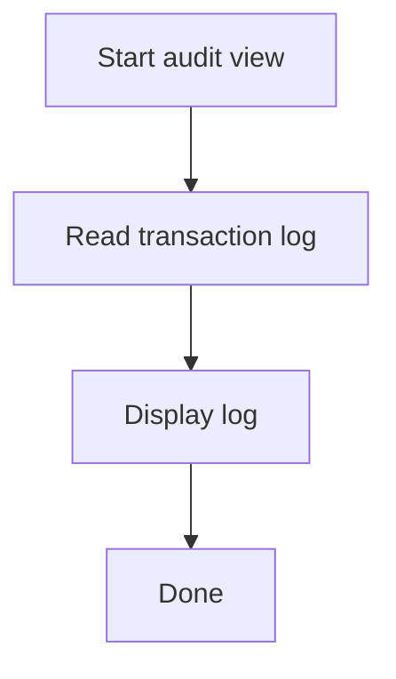

# Inventory Management System Flowchart

## 1. Main flow

## 2. Add product flow

## 3. Stock in flow

## 4. Stock out flow

## 5. Search product flow

## 6. Reports flow

## 7. Audit log flow

## Module overview

- Main program flow: [src/main.c](src/main.c)
- Product creation: [src/add_product.c](src/add_product.c)
- Stock in/out: [src/stock.c](src/stock.c)
- Search: [src/search.c](src/search.c)
- Reports: [src/reports.c](src/reports.c)
- Audit log: [src/audit.c](src/audit.c)
- File operations: [src/fileio.c](src/fileio.c)